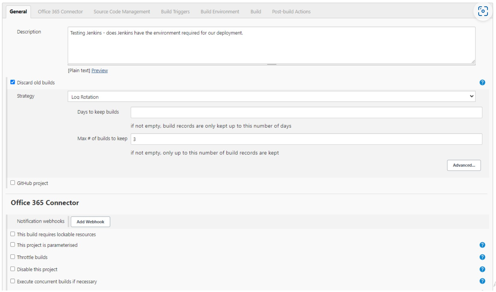

# Steps for using Jenkins


## Creating Jobs

### Logging into Jenkins

1) Go to the Jenkins login page.
2) Log in with the correct credentials.

### Creating a job on Jenkins

1) To create a new job on Jenkins:
- In the left hand pane, click on `New item`.
- Enter an item name for the job you're (something relatable) e.g. `alex-first-job`.
- Choose the project type, in this case `Freestyle project`.
- Click `OK`.
2) On the next page:
- Add a description under the "General" tab.
- Also in "General", limit the number of previous builds that can be kept so you don't end up with loads of jobs and crash the system
- Scroll down until you're in the "Build" tab and run commands to test out what the OS environment is and if Jenkins can run it.



3) Click `OK`

### Run the job

1) Next to the name of the job, in the dropdown list, click `Build now` to test the job.


## Connecting Jenkins to GitHub using SSH

### 1) Connecting Local computer to GitHub

1) Follow the steps in https://github.com/AlexAnderson220994/GitHub_SSH/blob/main/README.md
2) Create the SSH key pair and add the PUBLIC SSH key to Github.

### 2) Adding Public SSH key to GitHub Repo

1) Generate an entirely new SSH key pair (name it something like `jenkins_ssh`).
2) On GitHub, navigate to the specific Repo you want to connect to Jenkins.

3) Click on `Settings` in the top ribbon.
4) Click on `Deploy keys` on the left hand pane

5) Give the key a name
6) On Gitbash, navigate to your .ssh folder where your SSH keys are stored
7) Open the contents of the **PUBLIC** key using:
````
cat <key_name.pub>
````
8) Copy the public key that comes up (leave no spaces)
9) Paste they key into the "Key" box on the Deploy keys page.
10) Click `Allow write access`
11) Click `Add key`

## Setting up a webhook

1) On your GitHub repository that has the public SSH key connected:
- Go to settings
- Go to `Webhooks` in the left hand pane.
2) Go to `Add webhook`.
3) In "Payload URL" add the URL of the Jenkins account with `/github-webhook/` added to the end.
````
http://18.130.36.1:8080/github-webhook/
````
4) Change "Content type" to `application/json`
5) You can alter the events to trigger the webhook (but definitely needs to be triggered by pushing)

6) Go to your job on Jenkins
7) Go to "configure"
8) Make sure the your config looks like the below two images:


9) Test out the connection works by altering a test markdown file in that repository.
